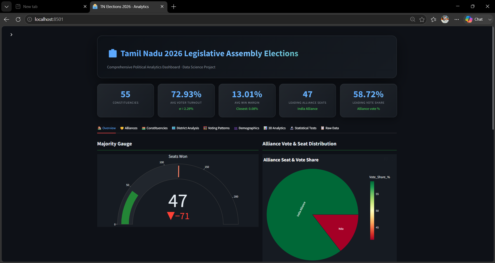
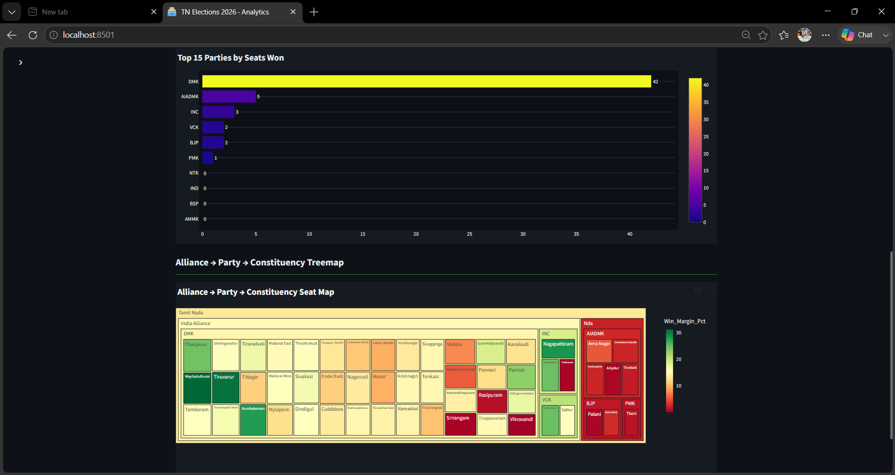
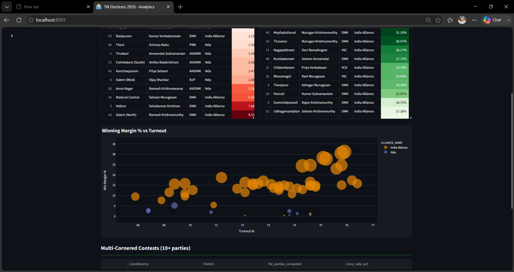
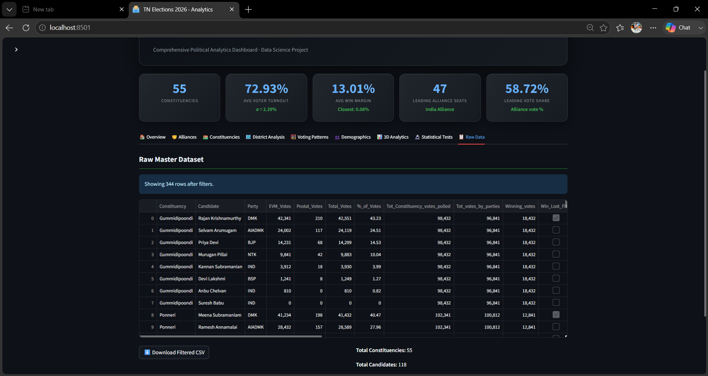
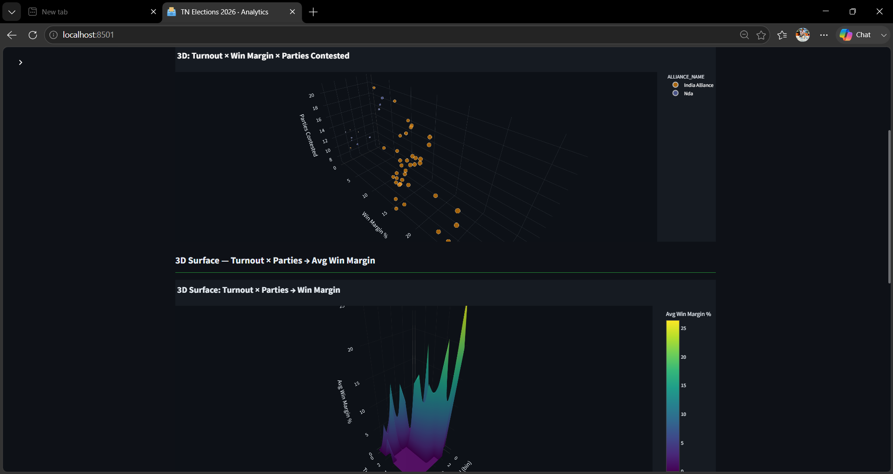
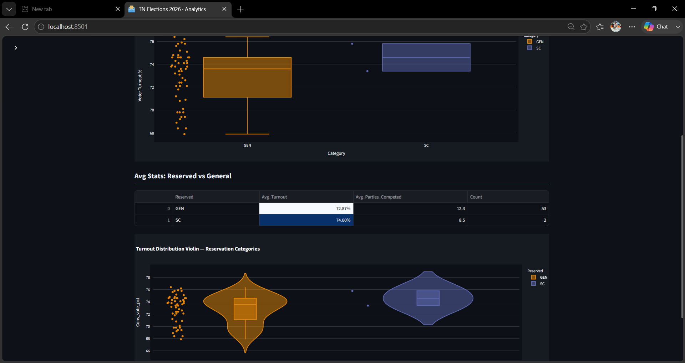
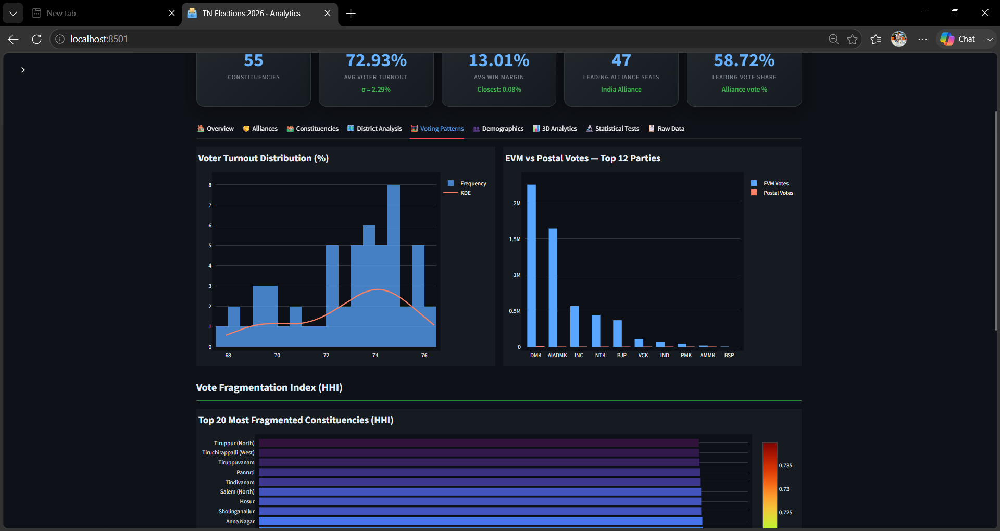
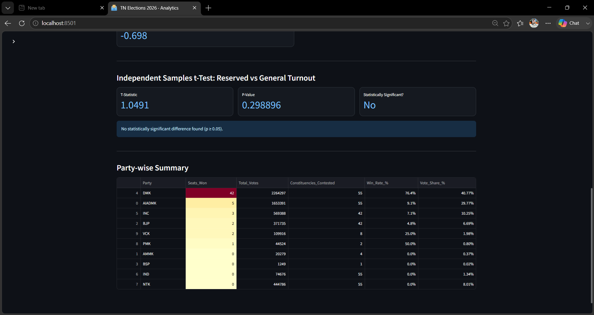

🗳️ Tamil Nadu 2026 Legislative Assembly Election — Data Science Project
📌 Project Overview
A comprehensive end-to-end data science project analyzing the 2026 Tamil Nadu Legislative Assembly Elections with constituency-wise results, alliance analytics, demographic behavior, voting patterns, and interactive 3D visualizations.

🗂️ Project Structure
TN_Elections_2026/
│
├── data/
│   ├── Tamil_Nadu_State_Elections_2026_Details.csv
│   ├── Tamil_Nadu_State_Elections_2026_Constituency_Metadata.csv
│   └── Tamil_Nadu_State_Elections_2026_Alliance.csv
│
├── notebooks/
│   └── EDA_TN_Elections_2026.ipynb
│
├── src/
│   ├── data_engineering.py       # Data loading, cleaning, feature engineering
│   ├── analysis.py               # Statistical analysis & pattern mining
│   └── visualizations.py         # All Plotly / Matplotlib charts
│
├── dashboard/
│   └── app.py                    # Streamlit 3D Dashboard (main entry point)
│
├── assets/
│   └── style.css                 # Custom CSS for Streamlit
│
├── requirements.txt
└── README.md

🔧 Setup & Installation
1. Clone / create project folder
bash
mkdir TN_Elections_2026 && cd TN_Elections_2026
2. Create virtual environment
bash
python -m venv venv
source venv/bin/activate        # Linux/Mac
venv\Scripts\activate           # Windows
3. Install dependencies
bash
pip install -r requirements.txt
4. Place CSV files in data/ folder
5. Run the Streamlit dashboard
bash
streamlit run dashboard/app.py

📊 Analysis Modules
Module	Description
Data Engineering	Cleaning, merging, feature creation (winning margin %, swing zones)
EDA	Distributions, outliers, party-wise summaries
Alliance Analytics	Seat share, vote share by coalition
Voting Patterns	Turnout heatmaps, postal vs EVM split
Demographic Behaviour	Reserved vs General constituency comparison
Competitive Analysis	Top contested seats, closest margins
3D Visualizations	Plotly 3D scatter, surface plots, globe map

## Dashboard Outputs

### Dashboard Home

### Analysis Dashboard 1

### Analysis Dashboard 2

### Data Analysis

### 3D Visualizations

### Average Statistics

### Voting Patterns

### Summary Dashboard

🛠️ Tech Stack
Python 3.10+
Pandas / NumPy — data engineering
Plotly Express & Graph Objects — interactive + 3D charts
Streamlit — web dashboard
Scikit-learn — clustering (KMeans swing zones)
Matplotlib / Seaborn — static charts / heatmaps
SciPy — statistical tests

🎓 Academic Details
Project Title: Analytical Study of 2026 Tamil Nadu Legislative Assembly Elections
Domain: Data Science / Political Analytics
Dataset: Kaggle — heisenricher/tamil-nadu-state-elections-2026-complete-dataset
   
